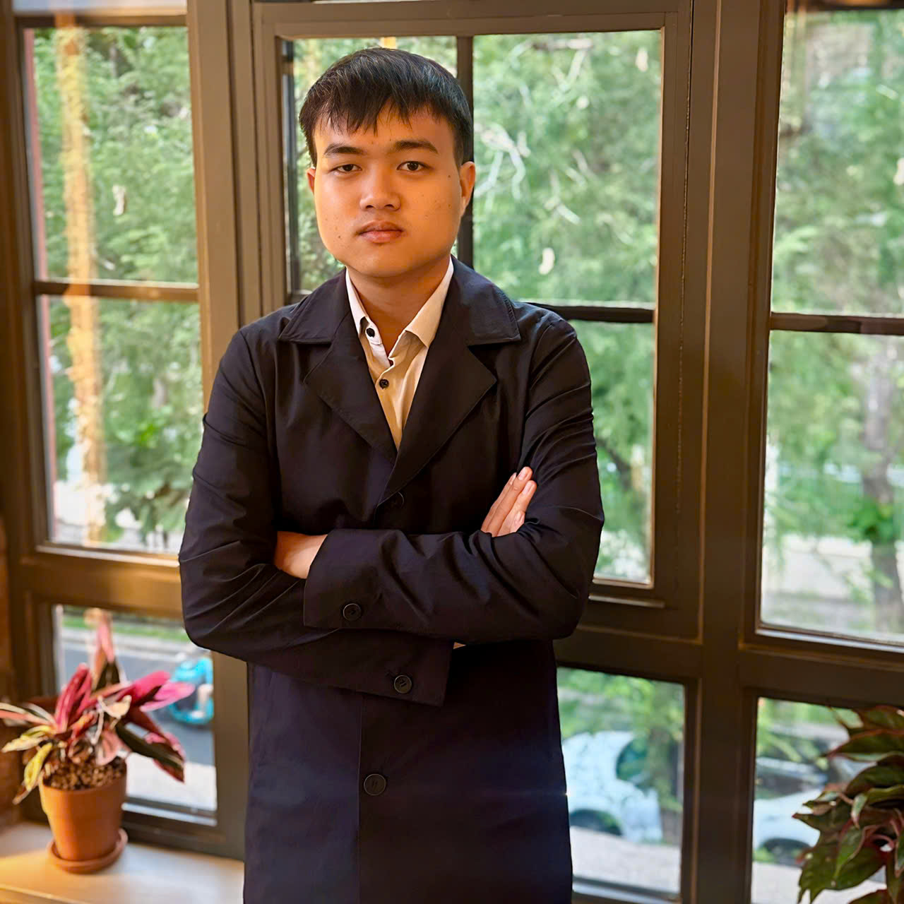

Hello! My name is Le Nguyen Phuc Loc, and I am a Junior DevOps Engineer with experience working at ATOM Solution, where I contributed to key projects in Payment and Cloud Computing.

During my time at ATOM Solution (from June 2024 to April 2025), I was involved in important production projects such as Atom Processor x BVBank, Merchant Platform x OCB, ViTrust, and WESAP. I gained a deep understanding of Payment systems, including Core Card, Core Banking, and the development and maintenance of secure payment system infrastructure, ensuring PCI-DSS compliance.

One of my key contributions was leading a campaign to optimize the company's cloud resources, resulting in a 40% reduction in infrastructure costs while maintaining performance and reliability. I also built and deployed CI/CD pipelines, managing scalable microservices on Kubernetes for Payment, ERP, and Web3 systems, improving the flexibility and efficiency of the software development process.

With expertise in tools like Jenkins, GitLab CI, and Terraform, as well as experience with containerized applications using Docker and Kubernetes, I played a pivotal role in migrating environments from AWS to CMC and FPT Cloud, optimizing performance and scalability.

In addition, I ensured high availability for critical systems such as PostgreSQL, Redis, MongoDB, Kafka, EMQX, and Minio, implementing replica and cluster configurations to guarantee fault tolerance and system resilience. I also automated system monitoring and logging using Grafana Stack and Elastic Stack, enhancing the ability to track and analyze system performance.

Beyond technical skills, I am a strong communicator and team player, always eager to learn and think creatively to find the best solutions for technological challenges.

I look forward to the opportunity to further discuss how I can contribute to future projects and the growth of the team!

  

