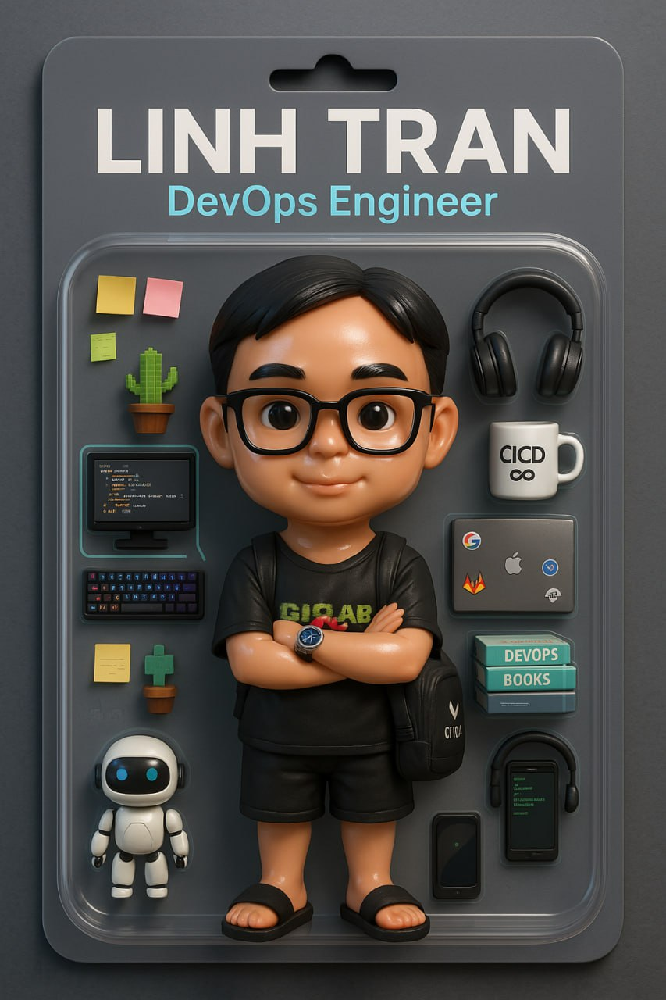

With one year of experience in DevOps, I have been involved in deploying and managing infrastructure for banking projects at Ban Viet Bank and OCB Bank. I am passionate about automating workflows, optimizing system performance, and ensuring stability and security in production environments.

My work includes provisioning and maintaining cloud-native infrastructure, managing Kubernetes clusters, implementing CI/CD pipelines using GitLab with Flux CD, Helm, and setting up centralized logging and monitoring with tools like Prometheus, Grafana, Loki and Wazuh. I have experience working with infrastructure-as-code (IaC) using Terraform and I collaborate closely with development and security teams to ensure scalable and secure system design.

I'm currently expanding my skills in cloud security and infrastructure design, with a career goal of moving toward DevSecOps and solution architecture. I aim to build end-to-end systems that are not only reliable and automated, but also secure by design. I'm continuously learning and enjoy sharing knowledge around modern infrastructure, cloud-native patterns, and DevOps best practices. I'm always open to connecting and exchanging ideas with professionals in the field.

  

