# 🕹️ TicTacToe High Availability Website - Serverless on AWS

## 🌐 Project Overview

This project demonstrates how to build a **highly available online TicTacToe game** using **Serverless Architecture** on **AWS**. It combines **WebSocket communication**, a **serverless backend**, and a **high availability frontend** infrastructure to provide a seamless, real-time gaming experience.

The system leverages a mix of **serverless services** (Lambda, DynamoDB, API Gateway) for backend logic and **compute infrastructure** (EC2, ALB, ASG, VPC) to ensure availability and scalability.

### 🖼️ Architecture Diagram


---

## 🛠️ Technologies Used

### ✅ Backend (Serverless Architecture)

- **AWS Lambda**  
  Handles backend logic for WebSocket API routes such as:
  - `connect`, `disconnect`
  - `sendMessage`, `joinRoom`, `getRoom`  
  Executes business logic upon invocation by API Gateway.

- **AWS API Gateway (WebSocket API)**  
  - Manages WebSocket connections with custom routes.
  - Triggers Lambda functions based on messages from clients.
  - Enables real-time bidirectional communication.

- **AWS DynamoDB**  
  - NoSQL database for storing game rooms, player info, and game state.
  - Implements **Time to Live (TTL)** for auto-expiry of stale data.
  - Uses **Streams** for tracking player online/offline status.

- **Amazon CloudWatch**  
  - Collects logs and metrics from **Lambda**, **API Gateway**, and **DynamoDB**.
  - Provides real-time monitoring for function invocation counts, durations, errors, throttles, and custom metrics.
  - Dashboards visualize game traffic, active players, and system health.

- **AWS SNS (Simple Notification Service)**  
  - Sends email alerts (e.g. player disconnected) based on DynamoDB stream events handled by Lambda.

---

### 🖥️ Frontend (Web Hosting + High Availability)

- **Amazon EC2 (Amazon Linux)**  
  - Hosts the online website on a public IPv4 address.
  - Runs application code and serves static content.

- **NGINX**  
  - Acts as a reverse proxy and web server.
  - Maps local IP to public IP, enabling access via HTTP/HTTPS.

- **Auto Scaling Group (ASG)**  
  - Automatically scales EC2 instances based on demand.
  - Ensures consistent performance during traffic spikes.

- **Application Load Balancer (ALB)**  
  - Distributes incoming traffic across EC2 instances.
  - Enhances fault tolerance and performance.

- **AWS VPC (Virtual Private Cloud)**  
  - Provides isolated network infrastructure.
  - Includes subnets, security groups, and routing for resource control.

---

### 🔧 EC2 Bootstrapping

- **Bash Scripts**  
  - Automatically install NGINX.
  - Generate a simple HTML page displaying EC2 instance metadata (e.g., public IP).

---

## 📈 Key Features

- Real-time gameplay using WebSocket communication.
- Automatically detects and notifies about player presence changes.
- Scalable and highly available architecture with EC2 + ALB + ASG.
- Secure and structured AWS environment using VPC.
- Modular and maintainable infrastructure using serverless components.

---

## 📬 Contact

For questions, feel free to reach out or open an issue.  
Happy coding and gaming! 🎮

**Le Nguyen Phuc Loc**  
*DevOps Engineer*  
*📧 phuclocdh2017@gmail.com*
*🌐 locdevops.cloud*

<!-- ## Table of contents

- [Pfsense, Client to Site \&  Site to site](#pfsense-client-to-site---site-to-site)
  - [Table of contents](#table-of-contents)
    - [What is Pfsense ?](#what-is-pfsense-)
    - [Features in pfsense](#features-in-pfsense)
    - [Setup firewall (Outscope)](#setup-firewall-outscope)
      - [Initial setup](#initial-setup)
        - [General Information](#general-information)
        - [Time Server Configuration](#time-server-configuration)
        - [WAN Interface Configuration](#wan-interface-configuration)
      - [Configure LAN Interface](#configure-lan-interface)
      - [Change the Admin password](#change-the-admin-password)
      - [Save parameters](#save-parameters)
      - [Configure Interface](#configure-interface)
      - [Configure Rule and NAT(port-forward)](#configure-rule-and-natport-forward)
        - [I. Rule WAN interface](#i-rule-wan-interface)
        - [II. Rule LAN interface](#ii-rule-lan-interface)
    - [Setup firewall (Inscope Non CDE)](#setup-firewall-inscope-non-cde)
    - [Build VPN](#build-vpn)
      - [Setup VPN Client to Site](#setup-vpn-client-to-site)
        - [Step 1: Configure WAN interface](#step-1-configure-wan-interface)
        - [Step 2: Create a Virtual IP](#step-2-create-a-virtual-ip)
        - [Step 3: Create Certificate Authority – CA](#step-3-create-certificate-authority--ca)
        - [Step 4: Create Server Certificate](#step-4-create-server-certificate)
        - [Step 5: Create a VPN – OpenVPN Server](#step-5-create-a-vpn--openvpn-server)
        - [Step 6: Create a VPN – OpenVPN Client](#step-6-create-a-vpn--openvpn-client)
        - [Step 7: Install the OpenVPN Client Export Utility, a tool that helps export the VPN client](#step-7-install-the-openvpn-client-export-utility-a-tool-that-helps-export-the-vpn-client)
        - [Step 8 : Create user OpenVPN](#step-8--create-user-openvpn)
        - [Step 9: Configure access permissions in the VPN](#step-9-configure-access-permissions-in-the-vpn)
        - [Step 10: Configure access to the VPN](#step-10-configure-access-to-the-vpn)
        - [Step 11: Configure NAT outbound](#step-11-configure-nat-outbound)
        - [Step 12: Export the VPN Client installation package](#step-12-export-the-vpn-client-installation-package)
        - [Step 13: Test the OpenVPN connection](#step-13-test-the-openvpn-connection)
      - [Setup VPN Site to site](#setup-vpn-site-to-site)
        - [Setup Network on CMC-Cloud Site HCM](#setup-network-on-cmc-cloud-site-hcm)
        - [Configure Interface OutScope, NonCDE, CDE Site HCM](#configure-interface-outscope-noncde-cde-site-hcm)
        - [Configure the IPSec tunnel Site HCM](#configure-the-ipsec-tunnel-site-hcm)
        - [Configure Firewall for local connections Site HCM](#configure-firewall-for-local-connections-site-hcm)
        - [Config Route table in CMC-Cloud on Site HCM](#config-route-table-in-cmc-cloud-on-site-hcm)
        - [Setup Network on CMC-Cloud Site HN](#setup-network-on-cmc-cloud-site-hn)
        - [Configure Interface OutScope, NonCDE, CDE Site HN](#configure-interface-outscope-noncde-cde-site-hn)
        - [Configure the IPSec tunnel Site HN](#configure-the-ipsec-tunnel-site-hn)
        - [Configure Firewall for local connections Site HN](#configure-firewall-for-local-connections-site-hn)
        - [Config Route table in CMC-Cloud on Site HN](#config-route-table-in-cmc-cloud-on-site-hn)
    - [Build VPN Route Base (Using OSPF)](#build-vpn-route-base-using-ospf)
      - [Routed IPsec (VTI)](#routed-ipsec-vti)
        - [HANOI - Khanh's zone (Vùng 1) - PHAN](#hanoi---khanhs-zone-vùng-1---phan)
        - [HCM - Khanh's zone (Vùng 2) - GIANG](#hcm---khanhs-zone-vùng-2---giang)
        - [HCM - Tram's zone (Vùng 3) - TRI](#hcm---trams-zone-vùng-3---tri)
      - [Step 1: Configure IPsec Tunnel on pfSense](#step-1-configure-ipsec-tunnel-on-pfsense)
      - [Step 2: Configure Phase 2 (Child SA) for VTI](#step-2-configure-phase-2-child-sa-for-vti)
      - [Create the VTI Interface](#create-the-vti-interface)
      - [Step 4: Firewall Rules for the VTI Interface](#step-4-firewall-rules-for-the-vti-interface)
      - [Testing the VTI Tunnel](#testing-the-vti-tunnel)
      - [Step 5: Setup for OSPF on pfSense with VTI](#step-5-setup-for-ospf-on-pfsense-with-vti)
        - [I. Install the FRR Package on pfSense](#i-install-the-frr-package-on-pfsense)
        - [II. Configure FRR Global Settings](#ii-configure-frr-global-settings)
        - [III. Configure OSPF in FRR](#iii-configure-ospf-in-frr)
        - [IV. Configure Static Routing in Pfsense](#iv-configure-static-routing-in-pfsense)
        - [V. Check status OSPF in FRR](#v-check-status-ospf-in-frr)
        - [V. Check ping](#v-check-ping)
    - [Build VPN With GRE-TUNNEL](#build-vpn-with-gre-tunnel)

### What is Pfsense ?

**`Pfsense`**: is an application that functions as a network firewall router and is free based on `FreeBSD`. Pfsense is configured through a web GUI interface for easy management and customization. It supports filtering based on source address, destination, source port, destination port, supports routing, and can operate in bridge or transparent mode.


Moreover, If using pfsense as a gateway, we can clearly see the support for NAT and port forwarding on pfsense as well as performing load balancing or failover on the network paths.

### Features in pfsense

1. *`Aliases`*: In pfsense, the firewall cannot have a rule consisting of multiple IP groups or a port group. Therefore, it is necessary to group IP, Port, or URL into one alias. An alias allows to substitute one host, one network range, multiple separate IPs, or a group of ports, URLs... Aliases help save time if used correctly.

2. *`NAT`*: Pfsense supports Static NAT in the form of NAT 1:1. The condition to perform NAT 1:1 is to have a public IP. When performing NAT 1:1, the Private IP being NAT-ed will always go out with the corresponding Public IP, and the ports will also correspond on the Public IP.

3. *`Powerful firewall`*: PFsense provides a strong firewall with the ability to filter packets based on IP address, port, protocol, application,... It also supports complex and flexible firewall rules. Rules must be created to manage the internal network.

4. *`Analyze and manage traffic`*: PFsense provides network traffic analysis tools such as NetFlow and many other plugins to help you understand and manage Internet usage in your network.

5. *`VPN (Virtual Private Network)`*: PFsense supports multiple VPN protocols such as *`IPsec`*, *`OpenVPN`*, *`L2TP`*, and *`PPTP`*, allowing secure VPN connections to be established between locations or remote users.

6. *`Proxy Server`*: PFsense can act as a `proxy server`, allowing to control and filter web content, providing security and managing Internet traffic.

7. *`Load balancing and failover`*: PFsense supports load balancing across multiple Internet connections to optimize network performance and availability. It also features redundancy to ensure service continuity.

8. *`Manage access control lists (ACL)`*: By using access control lists, you can control the Internet access rights of users in the network, from blocking access to specific websites to managing access time.

9. *`Security`*: PFsense supports many security features such as `IDS/IPS` (Intrusion Detection/Prevention System), `DPI` (Deep Packet Inspection), `DDoS` protection, to protect the network from various threats.

10. *`Managing DHCP and DNS:`*: PFsense also provides DHCP and DNS management services to automatically assign IP addresses and manage domains within the network.

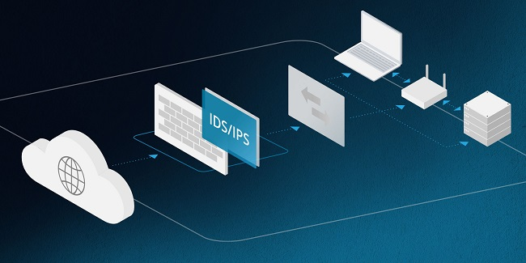

### Setup firewall (Outscope)

The pfSense solution is an open-source firewall project originating from the Monowall firewall project from many years ago. According to pfsense.org, thousands of enterprises use pfSense. Essentially, pfSense will include a full-featured firewall/L3 routing suite with many other features such as proxy server, IDS/IPS, high availability, certificate management, and centralized VPN.


#### Initial setup

> [!CAUTION]
> ***Error login HTTP_REFERER***
> 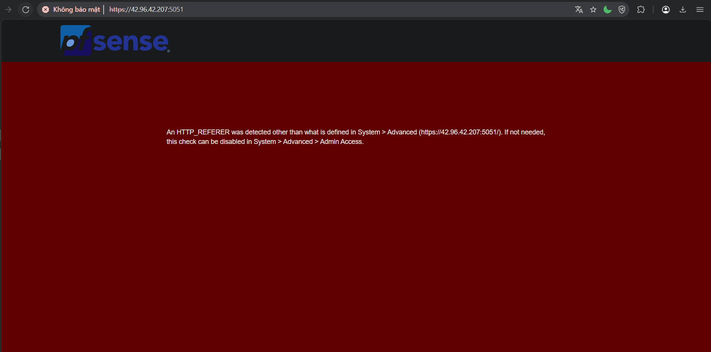

Access **terminal console** of **pfsense -> select number `8`**.


```sh
pfSsh.php playback disablereferercheck
```

> [!NOTE]
> ***ERR_CONNECTION_TIMED_OUT***

- Assignment Interface in pfSense:

  After configuring VLANs, pfSense will prompt you to assign the WAN interface. Typically, pfSense will display a list of network interfaces connected to it, such as vtnet0 and vtnet1. These are common virtual network interface names in cloud environments.
  - `Cloud Environment Consideration:`
    - In a cloud environment, if you do not have a VPN setup, pfSense will require a public IP address on the WAN interface to allow access to the User Interface (UI). This is crucial because, without VPN, the only way to manage pfSense remotely is through this public IP.

  - `WAN Configuration Before LAN:`
    - It is essential to configure WAN access rules before setting up the LAN interface, especially for ports 443 (HTTPS) and 80 (HTTP). `This is because, once the LAN interface is assigned, pfSense’s "Default Rule" will automatically shift from the WAN to the LAN interface`.
    - This behavior is part of pfSense’s security mechanism, where the default access rules will prioritize the LAN interface once it's assigned.

If you assign the LAN interface before configuring the necessary WAN rules, you might lose access to pfSense through the WAN interface. This happens because the default allow rules will then apply to the LAN, `leaving the WAN interface without the required access permissions`.

When accessing the Web UI interface, pfSense will automatically display the Setup Wizard page to set up the main parameters for the system.


Click **`Next`** to continue

##### General Information


Set up `Hostname`, `Domain`, `DNS Server`, then click `Next`

- Hostname: keep pfSense unchanged, you can change later.

- Domain: keep the default home.arpa, you can change later.

- Primary & Secondary DNS Server: Enter Cloudflare DNS (1.1.1.1 and 1.0.0.1) or Google DNS (8.8.8.8 and 8.8.4.4), or leave it blank.

- Override DNS: Select this if you want to use the DNS provided by the DHCP Server sent to the WAN port.

##### Time Server Configuration


Adjust time zone and Time Server. I use time server `1.vn.pool.ntp.org.`

##### WAN Interface Configuration

Configure the WAN Interface and LAN Interface according to the virtual network diagram designed in architecture.

1. **Step 1:**

   - Setup IP address of WAN and LAN in portal CMC-Cloud

    

   - Setup security group in portal CMC-Cloud

    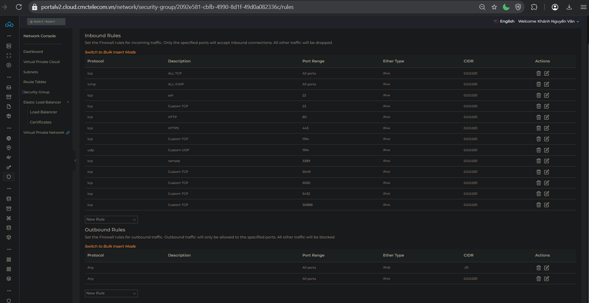

2. **Step 2:**

   - Set the WAN Interface Type to Static with the following IP parameters:

  

  **IP Address:** `172.24.48.8`

  **Subnet Mask:** `24`

  **Upstream Gateway:** `172.24.48.1` (IP of the Mikrotik Router)

  In a real-world scenario, if you are using pfSense to connect to the ISP's optical modem, you will need to change the WAN Interface Type to PPPoE and enter the provided Username/Password for connection authentication.

  

  Set the `WAN` Interface to `DHCP` IP

  

  Uncheck the option `Block RFC1918 Private Networks` and `Block bogon networks`

  Block RFC1918 Private Networks: This option means that pfSense will block all access to the WAN port from internal IP ranges (`10/8, 172.16/12, 192.168/16`).

  Since I'm using pfSense in a virtual network on CMC-Cloud, where all connections to the WAN port are internal IPs (`172.24.48.0/24`), it is necessary to uncheck Block RFC1918 Private Networks to allow the Host to access the pfSense management page.

#### Configure LAN Interface

Change LAN IP Address to `dhcp` and Subnet Mask `32`

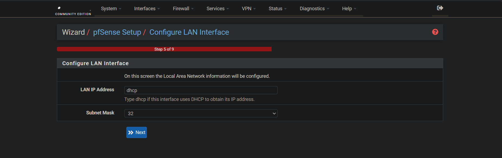

#### Change the Admin password

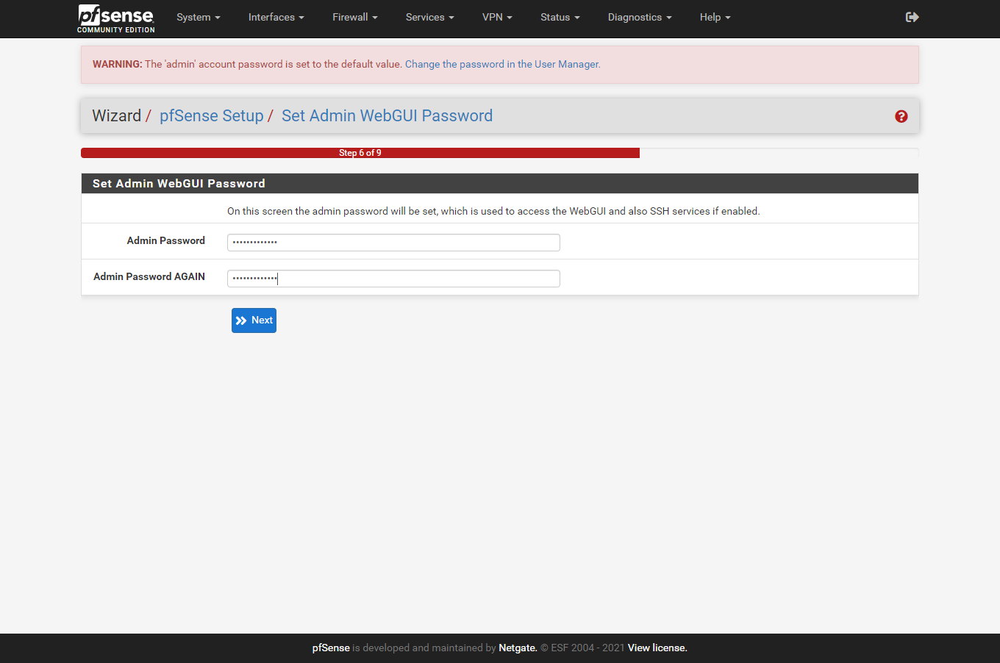

Enter `new password` for Admin account

#### Save parameters


Click `Reload` to let pfSense save the parameters and restart the service.

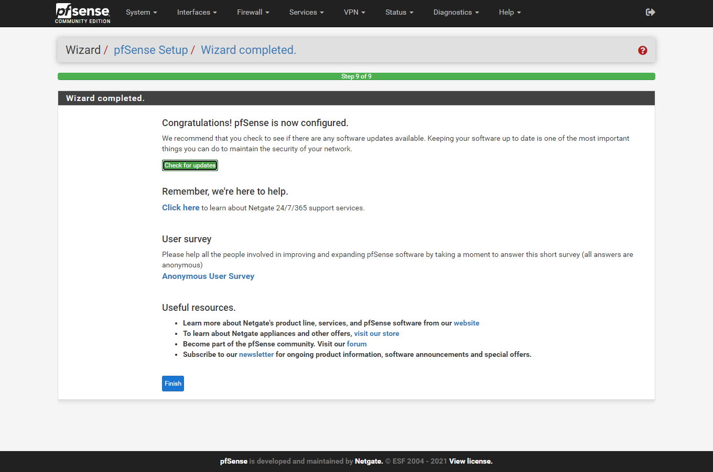

Click `Finish` to complete

**`Result:`** Dashboard of pfsense


#### Configure Interface

Add interface `vtnet1`

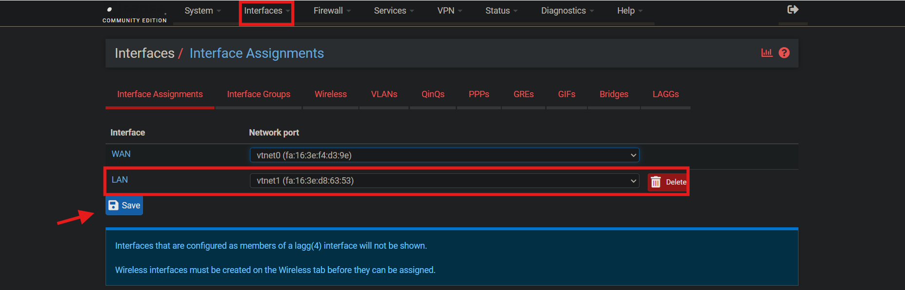

Config `WAN` interface


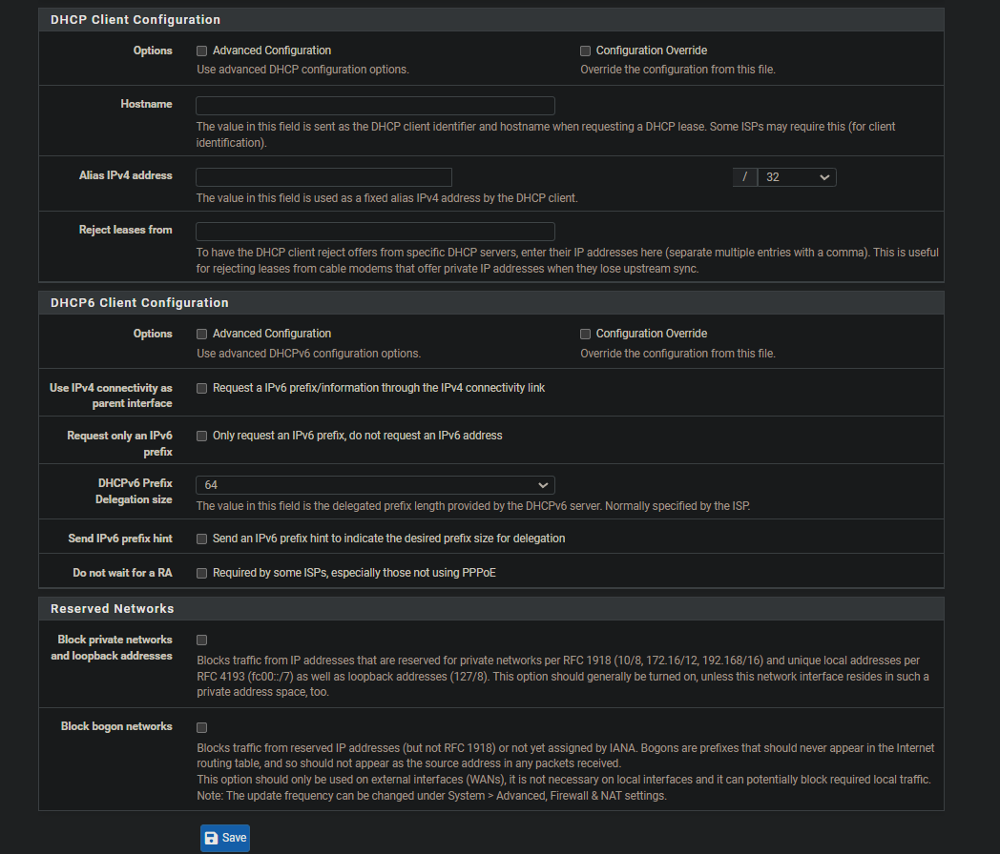

Config `LAN` interface


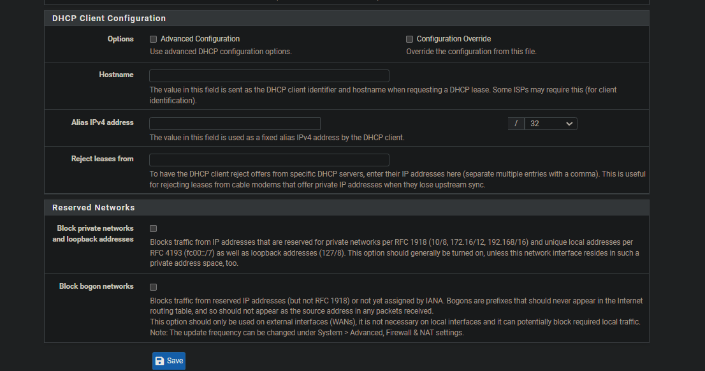

#### Configure Rule and NAT(port-forward)

> **Rule**

##### I. Rule WAN interface


- Allow Port access UI

    > [!NOTE]
    > If the service runs on two ports, `80 (HTTP)` and `443 (HTTPS)`, it should be configured to access the public IP address via a different port to avoid conflicts when configuring port forwarding.

  - Go to: System -> Advanced -> Admin Access -> webConfigurator -> TCP Port: 'Port different: 80 and 443' -> Save -> Apply changes and wait 20 seconds for automatic redirection. (Remember to create an Allow Rule for WAN Access on the configured port).

  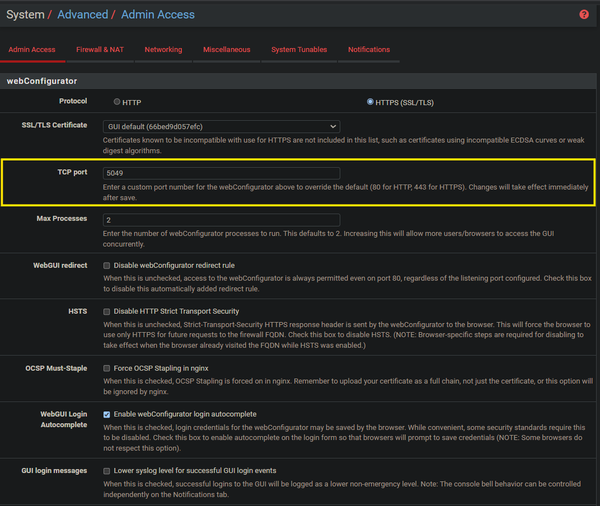 

- Virtual IP port-forward to 80 and 443

  To set up port forwarding to ports 80 and 443 using a Virtual IP, you need to configure the following steps:
  - Step 1. Create a Virtual IP on CMC-lor:
    - Go to Dashboard CMC-Cloud ->`Virtual Private Cloud` -> `Subnets` -> `subnet-outscope-bvb` -> `IP address`.

      

    - Select button `Assign Virtual IP address` -> `Automatic` -> `OK`.

      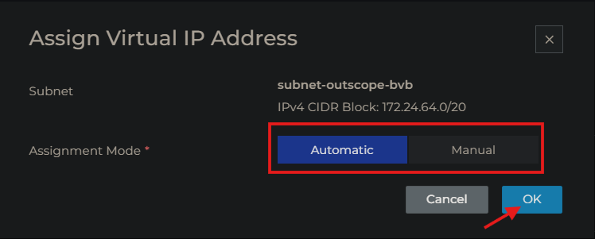

    - Continue select `Actions` -> `Bind to Server` -> `Select Server` -> `Select Port` -> `Bind Server`.

      

      

##### II. Rule LAN interface


> **NAT**

1. NAT Port-forward


- Go to Port Forwarding Settings:
  - Navigate to Firewall -> NAT -> Port Forward.
  - Click Add to create a new NAT rule for port forwarding.

Configure port forwarding from the `WAN` interface to the internal `NAT IP` (`172.24.65.98`) on port `80` (`HTTP`)

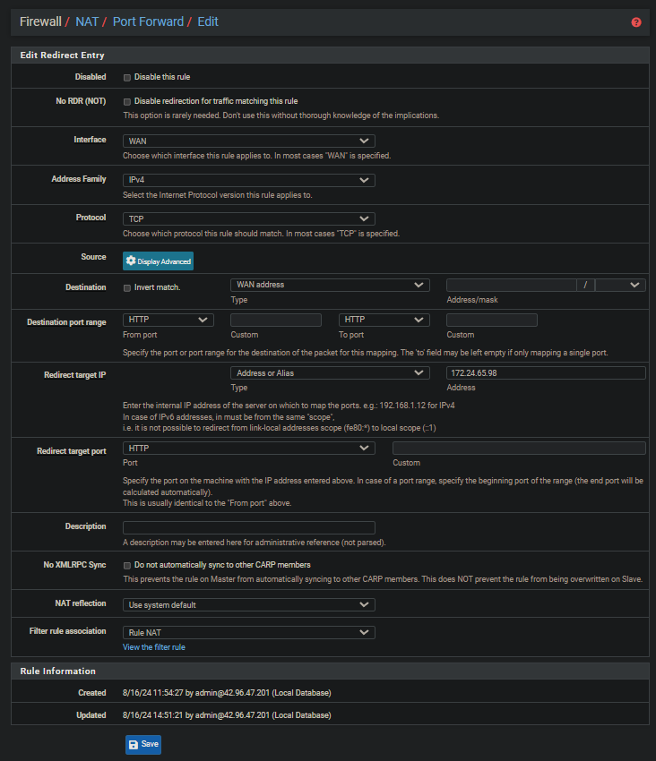

Configure port forwarding from the `WAN` interface to the internal `NAT IP` (172.24.65.98) on port `443` (`HTTPS`)

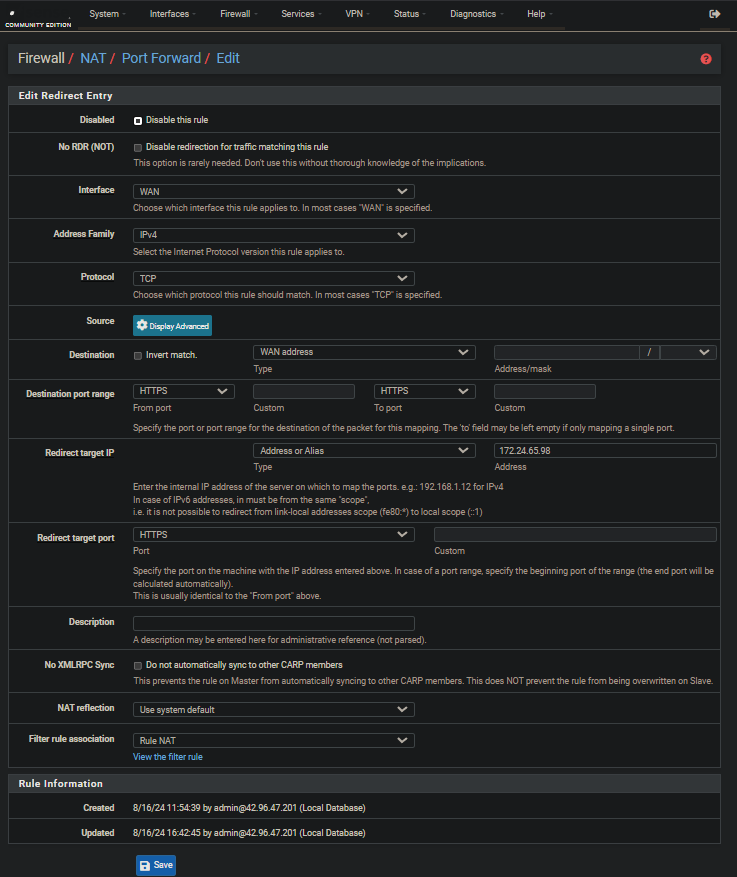

1. NAT Outbound

- Select `Hybrid Outbound NAT rule generation. (Automatic Outbound NAT + rules below)`
- Add Mapping LAN address to subnet 172.24.64.0/20 (outscope)


### Setup firewall (Inscope Non CDE)

### Build VPN

`OpenVPN` is a virtual private network (VPN) system that implements techniques to create secure point-to-point or site-to-site connections. It allows parties to authenticate each other using `pre-shared keys`, `certificates`, or `usernames/passwords`. When used in a multi client-server configuration, it enables the server to issue an authentication certificate to each client. It uses the OpenSSL encryption library as well as the widely-used *TLS protocol*, with many control and security features.

> [!NOTE]
> ***The pfSense firewall is installed and working with interfaces including WAN and LAN***

#### Setup VPN Client to Site

##### Step 1: Configure WAN interface

- Setup IP address of WAN in portal CMC-Cloud

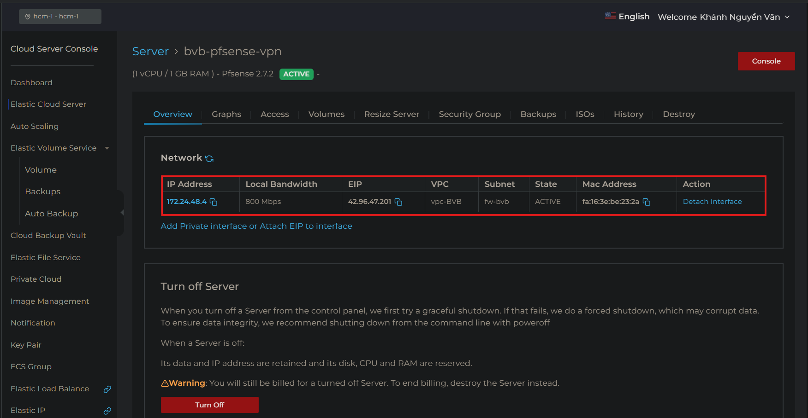

- Setup security group in portal CMC-Cloud


##### Step 2: Create a Virtual IP

- Navigate to Firewall -> `Virtual IPs`.
- Click `Add` to create a new Virtual IP.
- Set the `Type` to `IP Alias`.
- Assign the `Virtual IP Address` (42.96.47.201) that you want to use.
- Set the Interface to `WAN` or whichever interface you want the Virtual IP to be associated with.
- Save and apply the changes.


##### Step 3: Create Certificate Authority – CA

- Go to the menu `System > Cert. Manager`.

- Click button `Add` to create a new CA.

  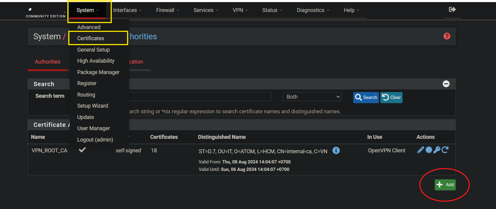

- Enter an identifying name for the CA.

- Set the `method` to **Create an internal Certificate Authority**.

- Select **Key Type**. (RSA, ECDSA..)

- Set the length of the key **Key length (2048, 4096, …)**.

- Select **Digest Algorithm encryption algorithm (sha256, sha512, …)**.

- Set a common name **Common Name (internal-ca, own-ca, ...)**.

  

- Save to complete CA

  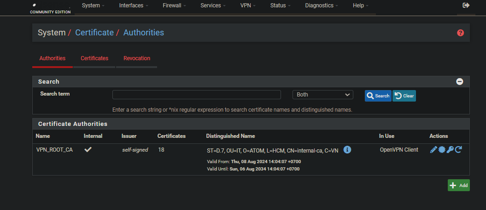

##### Step 4: Create Server Certificate

- Go to the `System > Cert. Manager menu`.

- Access the `Certificates` tab in the submenu.

- Select `Add/Sign` at the bottom right.

- Set the `Method` to `Create an internal Certificate Authority`.

- Enter a Descriptive name.

- Set the `Key length` and `Digest Algorithm` the same as the previously created `CA`.

- Adjust the `Lifetime` to 3650 days or customize it, not exceeding 398 days.

- Set the Common Name.

- Set the `Certificate Type` to Server `Certificate`.

  

- Save to complete `Server Certificate`.

##### Step 5: Create a VPN – OpenVPN Server

- Select the `VPN > OpenVPN`.

  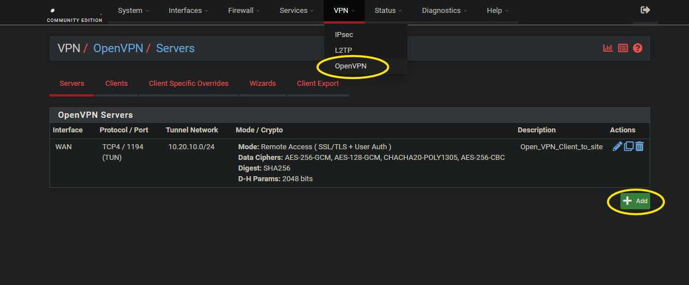

- Select `Add`.
  - General Information:
    1. Set **Server mode** to **Remote Access (SSL/TLS + User Auth)**.
    2. **Local port**, select the connection port, default port **1194**.
    3. Enter a **description**.

  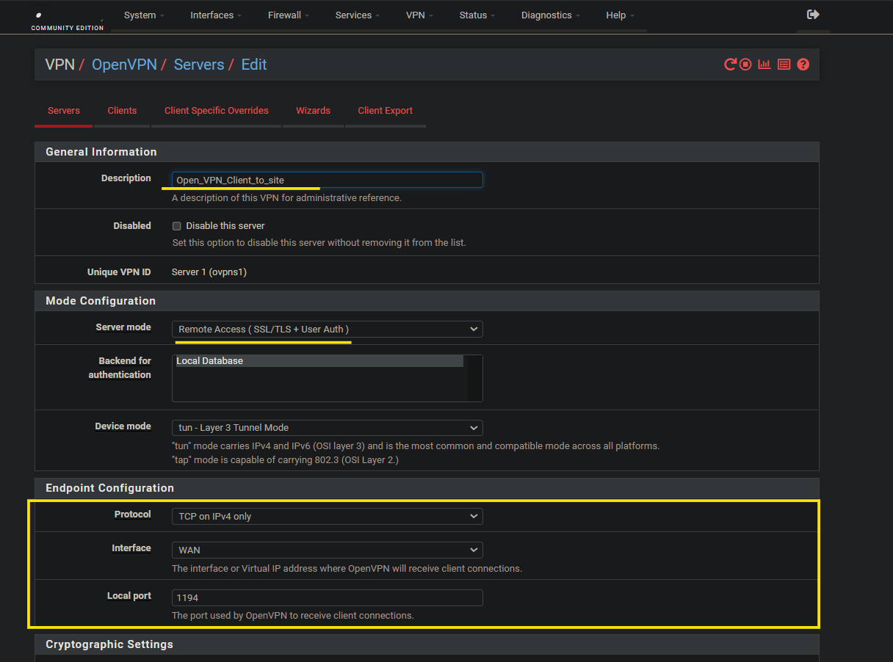

  - `Cryptographic` Settings:

    1. Select Use **TLS Key** and automatically enable **Automatically generate a TLS Key**.
    2. In **Peer Certificate Authority**, select the CA that was previously created.
    3. Select the **Server Certificate** created.
    4. Choose 2048 for **DH Parameter Length**.
    5. Set **Auth digest algorithm** to RSA-SHA256 (256-bit).

    

  - `VPN Tunnel` Settings:
    1. Create a subnet in **IPv4 Tunnel Network** as `10.20.10.0/24`.
    2. Leave **IPv6 Tunnel Network** blank.
    3. Enable **Redirect IPv4 Gateway**.
    4. Specify the `maximum number(20)` of clients allowed to concurrently connect to this server.

    

  - `Client Settings` and `Ping settings`

    Keep default setting

    

  - `Advanced Client Settings` and `Advanced Configuration`:

    1. Enable DNS Server and add IP DNS Server `10.20.10.1`.
    2. Choose IPv4 Only in Gateway creation; select Both if using IPv4 and IPv6.

    

- Press `Save` to update the configuration.

  

##### Step 6: Create a VPN – OpenVPN Client

- Navigate to `VPN > OpenVPN > Clients`.


- Click the `Add` button.

  - General Information:
    1. Enter a **description**.
    2. **Disabled**: Leave this unchecked or your client connection will be disabled.
    3. Set **Server mode** to **Peer to Peer (SSL/TLS)**.

    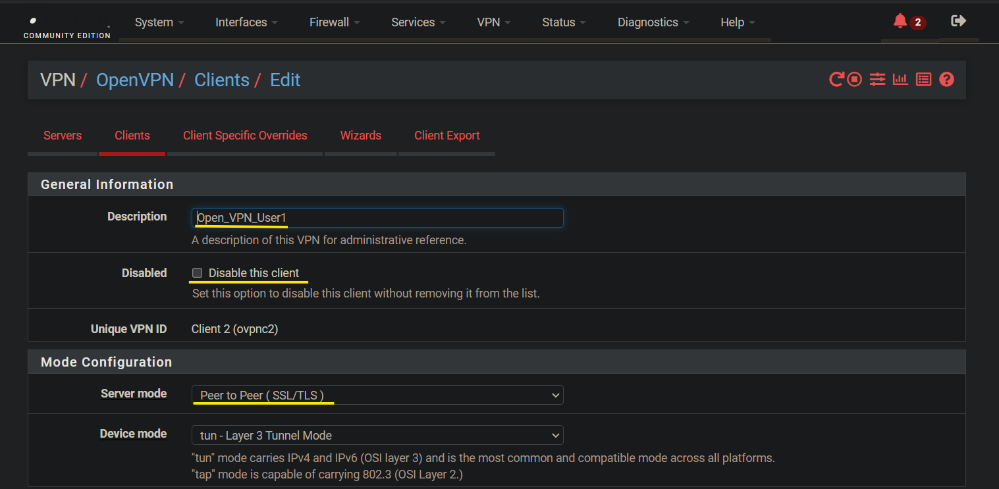

  - `Endpoint Configuration` Setting:
    1. **Protocol**:Have 2 option UDP and TCP. And we used *TCP only on IPv4*.
    2. Set **Interface**: `42.96.47.201((VIP))`. The virtual IP (VIP) was created previously.
    3. **Local port**: Leave blank unless specified by your VPN provider
    4. **Server host or address**: The IP address(*`42.96.47.201`*) or hostname of the VPN server to which you will connect.
    5. **Server port**: The port(*`1194`*) over which the VPN connection will be made.
    6. **Proxy host or address**: Leave blank
    7. **Proxy port**: Leave blank
    8. **Proxy Authentication**: none
    

  - `User Authentication` Settings
    1. Username: Your username, client identifier, account number, etc.
    2. Password: Your password (if required)
    3. Automatic Retry: Leave unchecked so that your client will attempt to reconnect when authentication fails.
  
    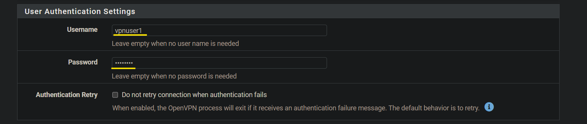

  - `Cryptographic` Settings
    1. Select Use **TLS Key** and automatically enable **Automatically generate a TLS Key**.
    2. In **Peer Certificate Authority**, select the CA that was previously created.
    3. **Client Certificate**: Leave this set to None.
    4. Set **Auth digest algorithm** to RSA-SHA256 (256-bit).

    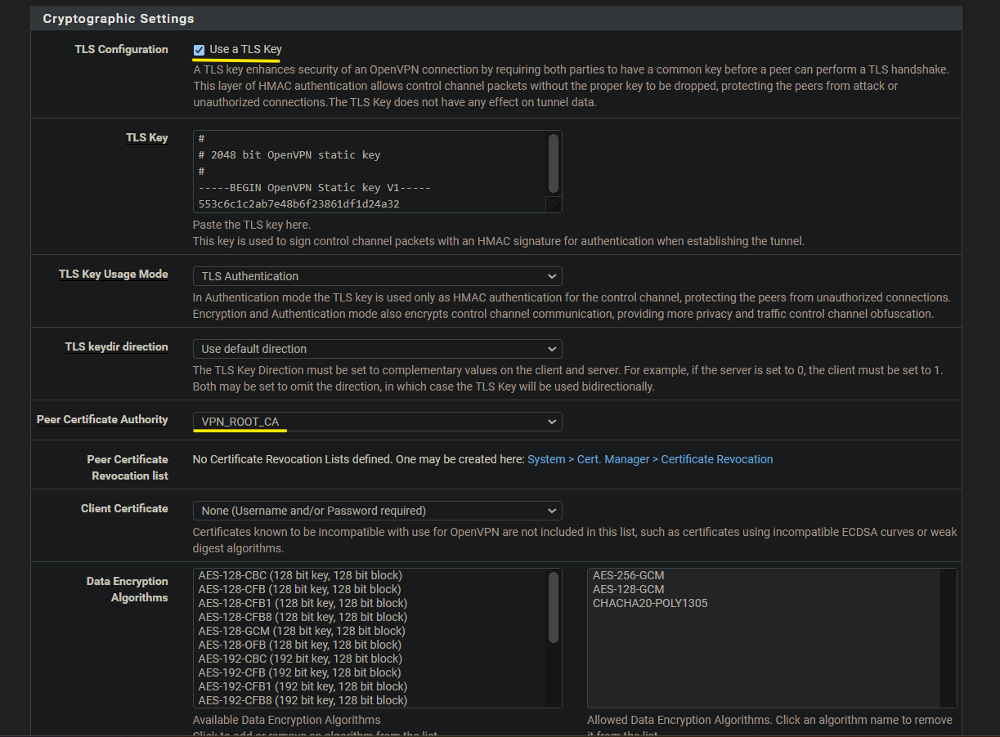

  - `VPN Tunnel` Settings: Keep default in Tunnel Setting section.

    

  - `Ping settings`

    Keep default setting

    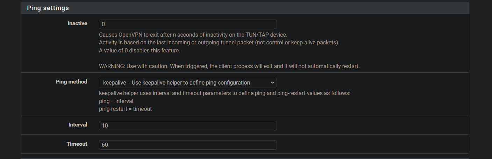

  - `Advanced Configuration`:
    - Choose IPv4 Only in `Gateway creation`; select Both if using IPv4 and IPv6.

    

- Press `Save` to update the configuration.

  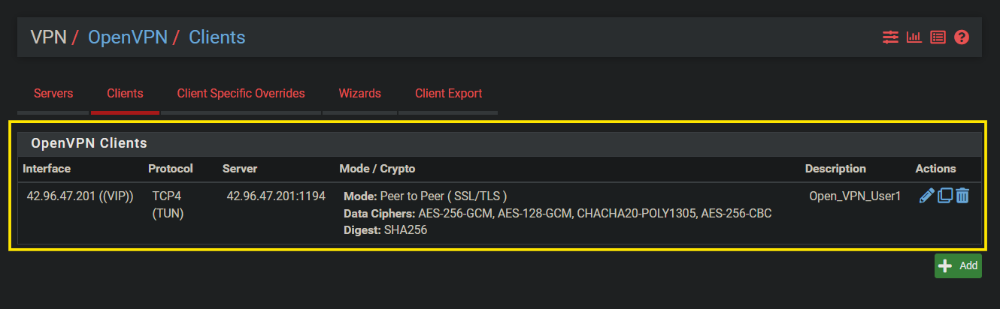

##### Step 7: Install the OpenVPN Client Export Utility, a tool that helps export the VPN client

- Go to `System > Package Manager`.

- Select **Available Packages** in the submenu.

  

- Find the `openvpn-client-export utility` and select **install** to install it.

  

- Press **confirm** to install.
  
- Once installation is complete, **Success** will be displayed in the **Package Installer** interface.
  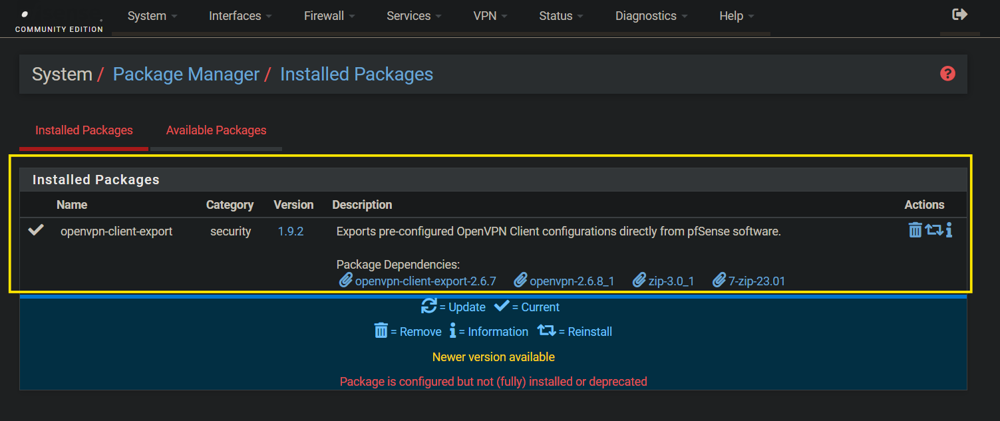

##### Step 8 : Create user OpenVPN

- Go to the menu **System > User Manager**.

  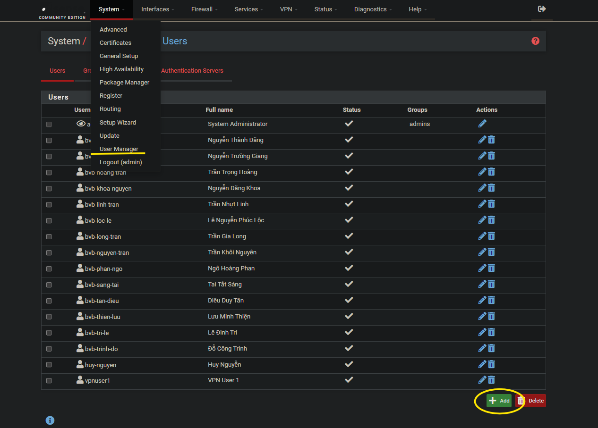

- Select the **Add** button and enter a **Username** and **Password** for your user.

- Press **Save**, and the **OpenVPN user** will be successfully created and then redirected to the initial interface.

- Configure the authentication method as certificate and password.

- Select **Add** -> **User Certificate** and enter additional information.

- Set the method (**Method -> Create an internal Certificate**).

- Choose **Key length, Type, and Digest Algorithm** to match the previously created **CA**.

- Set the expiration time **Lifetime to 3650 days**.

- Ensure that **Certificate Type** is selected as the user certificate just created **(User Certificate)**.

- **Save** to complete linking the user certificate with the OpenVPN user **(User Certificate – OpenVPN user)**.

  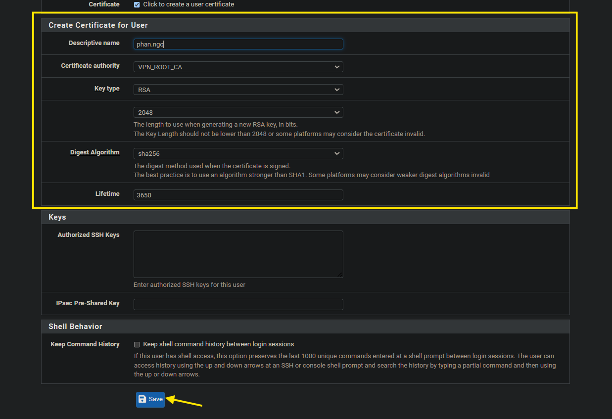

- Press **Save** to complete the setup of creating the user account for OpenVPN.

##### Step 9: Configure access permissions in the VPN

- Go to the `Firewall > Rules` menu.
- Select **OpenVPN**.
- Select the first **Add** to add a new rule.
  
- **Interface**: OpenVPN
- **Address Family**, choose **IPv4** only.
- **Protocol**, select **TCP**.
  

- `Source`, choose **any**.
- Enter a **description**, press Save, and Apply Changes to save the configuration.

  

##### Step 10: Configure access to the VPN

- Go to the `Firewall > Rules` menu.
- Select the **WAN** tab.
- Click **Add** to add a new rule.

  

- Set **Address Family** to **IPv4**.
- **Protocol**, choose **TCP**.

  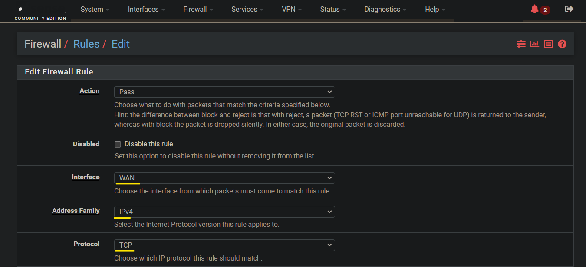

- Set **Source** to **any**.
- `Destination Port Range`, enter the OpenVPN port configured earlier, which is **`1194`**.
- Enter a **description**, press **Save**, and Apply Changes to save the configuration.

  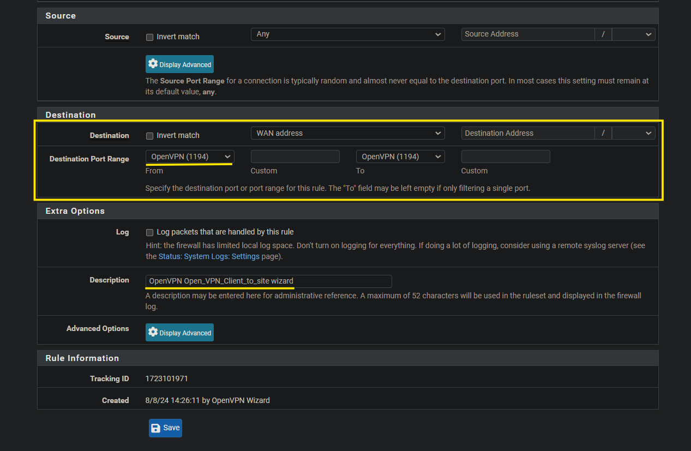

##### Step 11: Configure NAT outbound

- Navigate to `Firewall > NAT > Outbound`.
  - Outbound NAT Mode: ***Hybrid Outbound NAT rule generation.
(Automatic Outbound NAT + rules below)*** and then click **Save** and Apply Changes NAT rules.
  
  - Mappings Configure
    - Click the green **Add** button with a downward pointing arrow, to create a new NAT rule.
    - Set the **Interface** field to the VPN interface we created earlier.
    - Set the **Address Family** to either IPv4 or IPv4+IPv6 if your VPN provider explicitly supports IPv6.
    - Set the **Source** and **Destination** network with subnet address.
    - Leave all the other settings untouched. Click **Save** and **Apply Changes**.

    ! [pfsense](Imgs/cts_nat2.png)

##### Step 12: Export the VPN Client installation package

- Go to `VPN > OpenVPN`.
- Select `Client Export` in the submenu.
- Select the correct **OpenVPN** server next to **Remote Access Server**.
- If using `Dynamic DNS` to access the pfSense **WAN** network, choose **Other** and select **Host Name Resolution** (This setting allows access to the pfSense WAN network using a name instead of an IP address, ensuring no loss of access to the OpenVPN server if the ISP changes the IP or WAN network). `Exp: 42.96.47.201`
- If not using this, set **Host Name Resolution** to **Interface IP Address**.

  

- Scroll down to the user location to download the VPN Client installation file, and choose the appropriate installation file.
  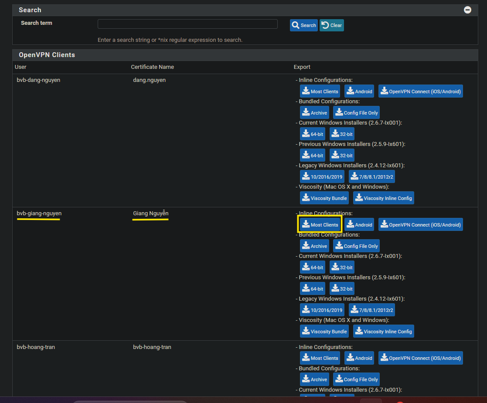

##### Step 13: Test the OpenVPN connection

- Run the installation file for the **VPN Client** that was downloaded.
- Once successfully connected to **OpenVPN**,

  

- Network information – when connected to **OpenVPN**.
  

  

  

#### Setup VPN Site to site

> Site HCM

Start with configuring the tunnel and related settings on the firewall at Site HCM.

##### Setup Network on CMC-Cloud Site HCM

1. Setup IP address of `WAN` and `LAN` in portal `CMC-Cloud`:

    Add **IP private** and **IP public**
    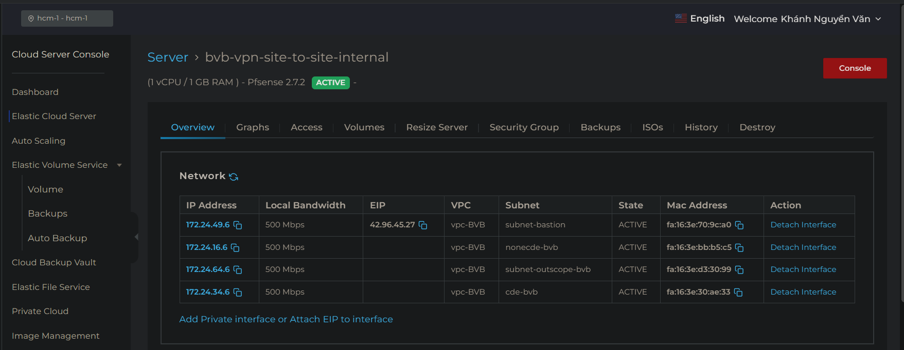
2. Setup **security group** in portal CMC-Cloud
    
3. `Allowed address pairs`
   - Double click to open tab `Update port` -> **Allowed address pairs**
   - Add Security Group
   - Add *`IP Address or CIDR *`* -> `Mac Address`
   - Click Add to create a new **Allowed address pairs**.
  
    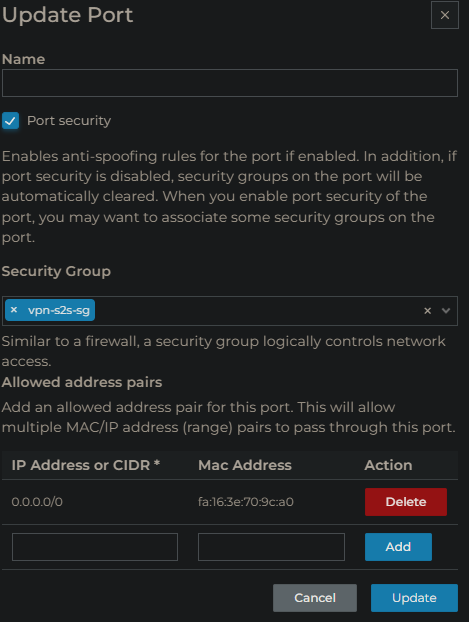

    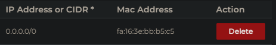

    

    

##### Configure Interface OutScope, NonCDE, CDE Site HCM

Let's start.

First, configure the internal LAN and the gateway interface. To do this, in the browser, go to the server IP address or domain name if any. Enter the username and password and get to the Home screen (Dashboard). In the program menu, go to the interfaces section `Interfaces -> Assignments`. In our case, have 3 interfaces are already distributed - we leave it as it is. If you have several interfaces, you should select the necessary interface by mac-address and click the Add button.

Assign an IP address to the interface **“looking”** to the local network.

- Add interface vtnet1 (OutScope)
- Add interface vtnet2 (NonCDE)
- Add interface vtnet3 (CDE)


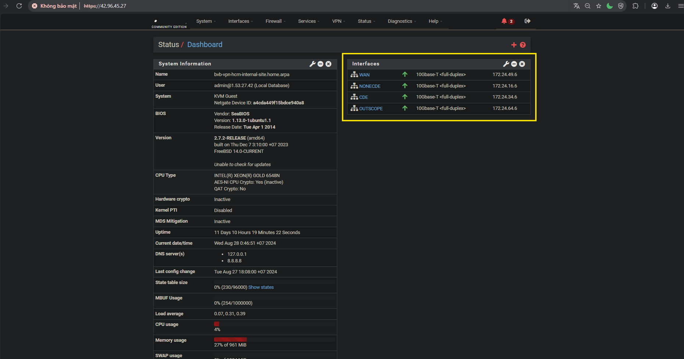

In the program menu, change interface name `interfaces section -> OutScope | NonCDE | CDE`. At the end of the setup, click the Save button.

For all servers in the local network, as the default gateway, set the IP address specified in the LAN.

- Assign `Interface > OutScope`
  - Setting `General Configuration`
    - Select **enable interface**
    - IPv4 Type: **DHCP**
  - DHCP Client Configuration
    - Keep default
  - Reserved Networks
    - Untick **Block private networks and loopback addresses** and **Block bogon networks**

  

- Do the same with CDE and Non CDE
  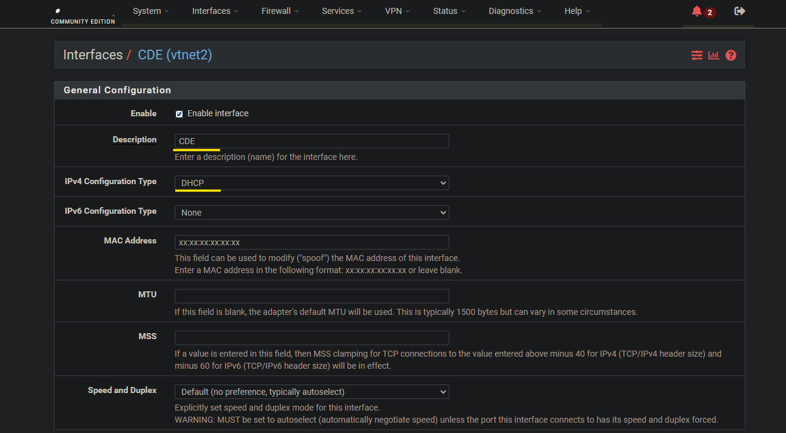
  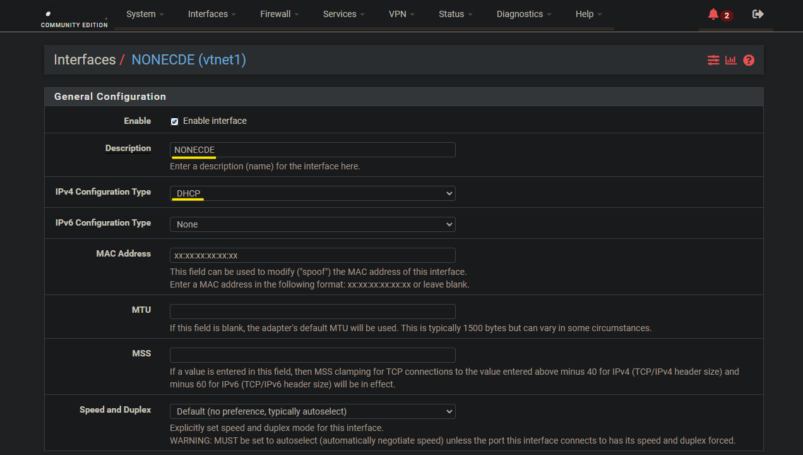
  
`Important!` If you use cloud services, then you need to unite the network nodes from the administration panel of the cloud service through `“Virtual Networks”`.

##### Configure the IPSec tunnel Site HCM

***`Phase 1`***

- Access the `VPN > IPSEC > Tunnel` section
- Click on the **ADD P1** button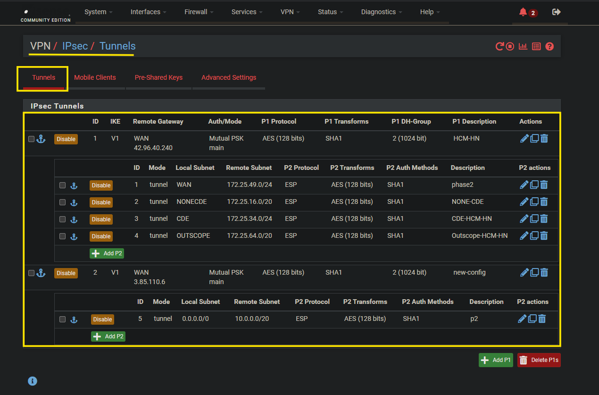
- In the Phase 1 configuration page of the IPsec VPN on the pfsense server, fill in the information according to the configuration similar to IPSec VPN in site HN.
  - `General Information` Setting
    - Enter a **Description**
    - Uncheck **Disabled** this box so that the tunnel will be operational.
  - `IKE Endpoint Configuration`
    - Key Exchange version: Specifies whether to use IKEv2 or IKEv1. IKEv2 is the best practice when supported by both endpoints. If one side does not support IKEv2, use **IKEv1** instead.
    - Internet Protocol: **IPv4** in most cases unless both WANs have IPv6
    - Interface: Most likely set to **WAN**
    - Remote Gateway: The WAN address at Site HN, in this example: `42.96.40.240`.
    
  - Setup `Phase 1 Proposal (Authentication)`
  
    The next section controls IPsec phase 1 proposals for encryption.
    - Authentication Method:The default, **Mutual PSK**
    - Negotiation mode: **Main**
    - My Identifier: **My IP Address**
    - Peer Identifier: **Any**
    - Pre-Shared key: generate a key (we will also need this value on our end)
  - `Phase 1 Proposal (Encryption Algorithm)`
  
    Encryption Algorithm:
    - Algorithm Select **AES**
    - Key length use **128bits**
    - Hash use **SHA256**
    - DH group **2** (1028bit)
  - `Expiration and Replacement`
    - The Expiration and Replacement section controls the timing and method by which phase 1 will be renegotiated.
      - Life Time: The default `28800` is OK for this endpoint.
      - The other lifetime-related values (Rekey Time, Reauth Time, Rand Time) should be left at their defaults on this endpoint as they are automatically calculated as the correct values.
  - `Advanced Options`
    - Child SA Close Action: Set this endpoint to **Default**. Moreover, have options **Restart/Reconnect** so that the phase 2 entries will be reconnected if they get disconnected.
    - Leave checked and at the default values.
  
  - Click **Save** when complete

***`Phase 2`***

With the phase 1 entry complete, now a new phase 2 definition to the VPN:

- Click **Show Phase 2 Entries** to expand the phase 2 list for this VPN.

- Click **Add P2** to add a new phase 2 entry.

Now add settings for phase 2 on this VPN. The settings for phase 2:

- `General Information`
  - Description: A brief description of the network(s) involved in this phase 2 entry.
  - Mode: Select ***Tunnel IPv4***
- `Networks`
  - Local Network: **WAN subnet** with interface WAN. **LAN Subnet** with interfaces: OutScope, CDE and NonCDE.
- `NAT/BINAT`
  - Set to **None**.
- `Remote Network`
  - Set to the network at Site HN, in this case: `172.25.49.0/24`

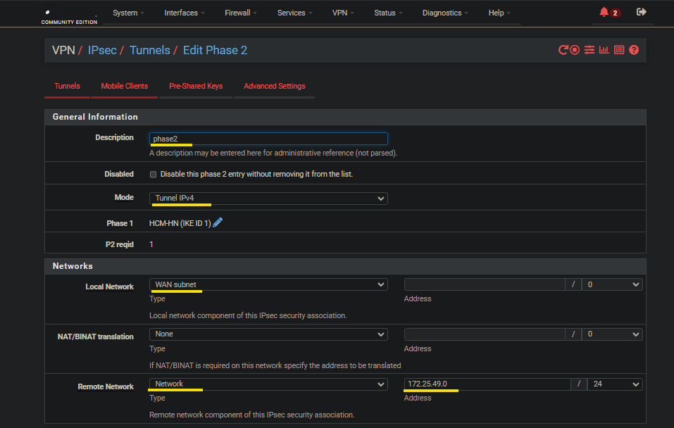

The next section of the phase 2 settings covers traffic encryption. Encryption algorithms and Hash algorithms can both be set to allow multiple options in phase 2, and both sides will negotiate and agree upon the settings so long as each side has at least one of each in common. In some cases that may be a good thing, but it is usually better to restrict this to the single specific options desired on both sides.

- `Phase 2 Proposal (SA/Key Exchange)`
  - Protocol: Set to **ESP** for encryption.
  - Encryption Algorithms: **AES (128bits)**
  - Hash algorithm use **SHA1**
  - PFS key group with **2(1024bit)**

- `Expiration and Replacement` and `Keep Alive`
  - Keep default


***NonCDE***

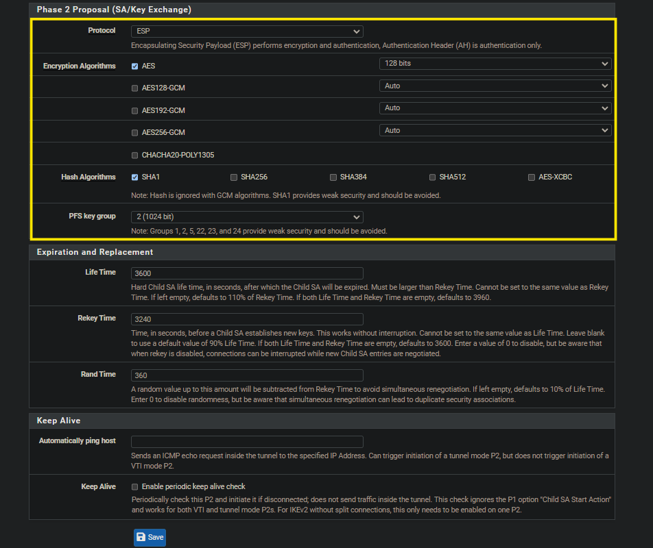

***CDE***

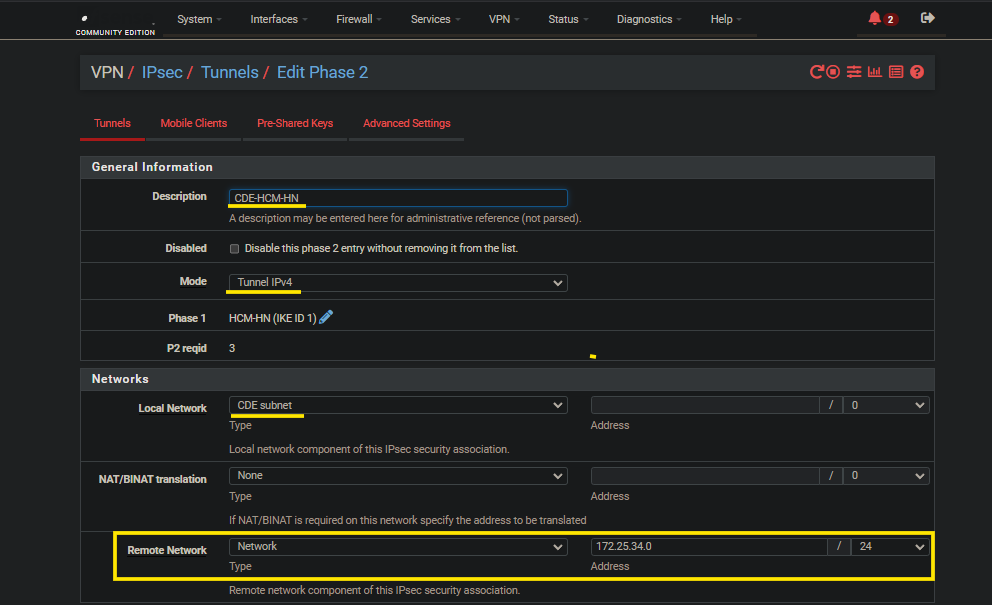

***OutScope***


`Result:`


##### Configure Firewall for local connections Site HCM

In the program menu, select `Firewall -> Rules -> WAN`. Click the **Add** button.

- Protocol: **TCP**, but you can also use Any.

- Source: **Any**.

- Destination: **Any**.


Configure rule OutScope VPN: `Firewall -> Rules -> OutScope`

- On the new page we check the parameters:

  - Customizable interface: **OutScope**.

  - Protocol: **TCP**, but you can also use Any.

  - Source: **Any**.

  - Destination: **Any**.
- Save the settings by clicking on the Save button.


Do the same with CDE and Non CDE


Configure rule IPSec VPN: `Firewall -> Rules -> IPSec`

- Protocol: **TCP**, but you can also use **Any**.

- Source: **Any**.

- Destination: **Any**.


It should be noted that the same settings must be made on all remote pfSense servers connected to a single network.

##### Config Route table in CMC-Cloud on Site HCM

A route table contains a set of rules, called routes, that determine where network traffic from your subnet or gateway is directed.

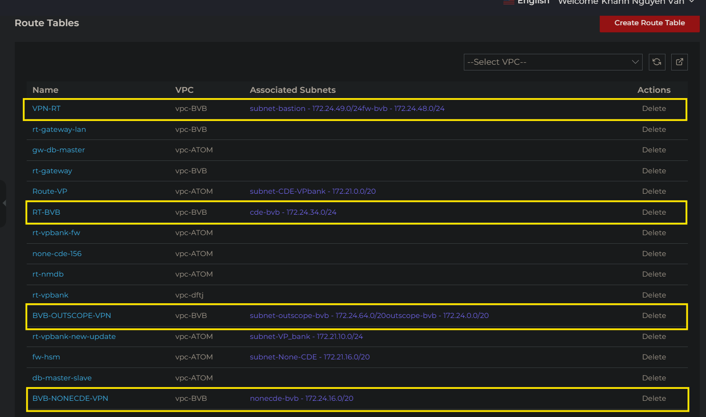


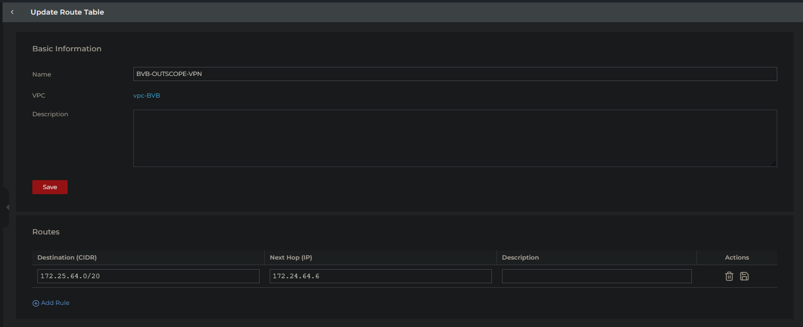


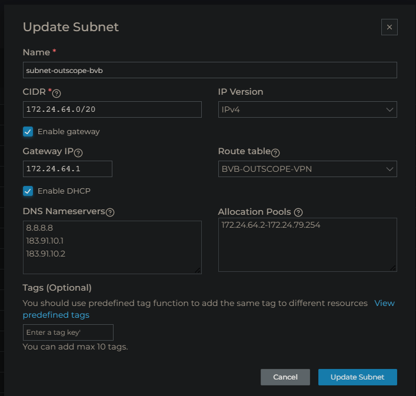


===================================================

> Site HN

Now that Site HCM is configured, it is time to tackle Site HN. Repeat the process on the Site HN endpoint to add a tunnel.

##### Setup Network on CMC-Cloud Site HN

1. Setup IP address of `WAN` and `LAN` in portal `CMC-Cloud`:

    Add **IP private** and **IP public**
    
2. Setup **security group** in portal CMC-Cloud
    
3. `Allowed address pairs`
   - Double click to open tab `Update port` -> **Allowed address pairs**
   - Add Security Group
   - Add *`IP Address or CIDR *`* -> `Mac Address`
   - Click Add to create a new **Allowed address pairs**.
  
    

    

    

    

##### Configure Interface OutScope, NonCDE, CDE Site HN

Let's start.

First, configure the internal LAN and the gateway interface. To do this, in the browser, go to the server IP address or domain name if any. Enter the username and password and get to the Home screen (Dashboard). In the program menu, go to the interfaces section `Interfaces -> Assignments`. In our case, have 3 interfaces are already distributed - we leave it as it is. If you have several interfaces, you should select the necessary interface by mac-address and click the Add button.

Assign an IP address to the interface **“looking”** to the local network.

- Add interface vtnet1 (OutScope)
- Add interface vtnet2 (NonCDE)
- Add interface vtnet3 (CDE)


In the program menu, change interface name `interfaces section -> OutScope | NonCDE | CDE`. At the end of the setup, click the Save button.

For all servers in the local network, as the default gateway, set the IP address specified in the LAN.

- Assign `Interface > OutScope`
  - Setting `General Configuration`
    - Select **enable interface**
    - IPv4 Type: **DHCP**
  - DHCP Client Configuration
    - Keep default
  - Reserved Networks
    - Untick **Block private networks and loopback addresses** and **Block bogon networks**

  

- Do the same with CDE and Non CDE
  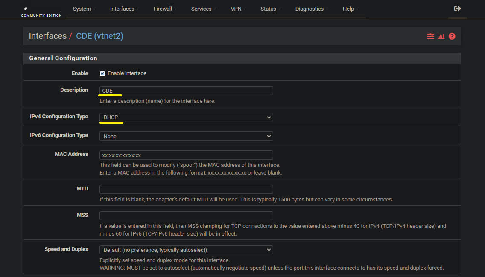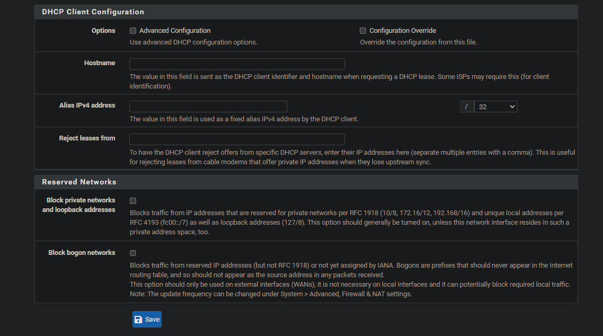
  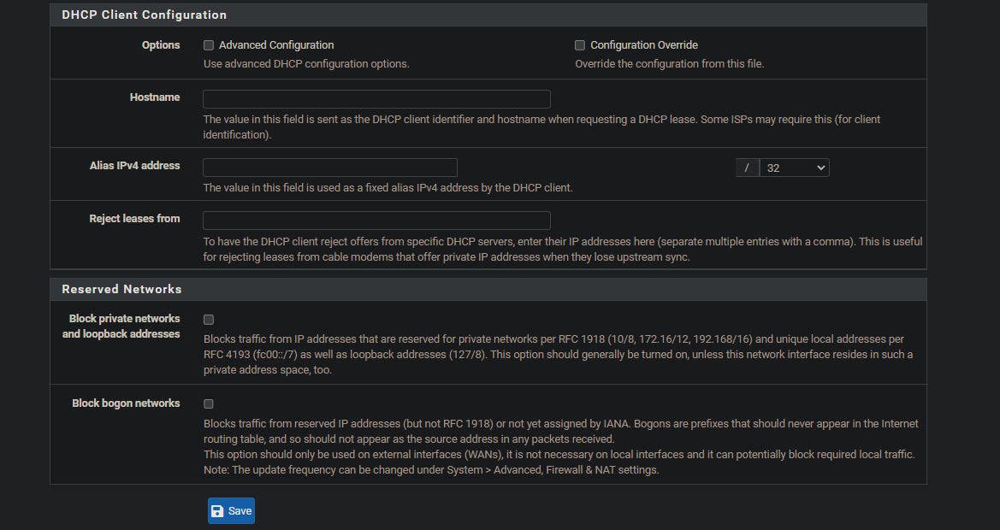
  
`Important!` If you use cloud services, then you need to unite the network nodes from the administration panel of the cloud service through `“Virtual Networks”`.

##### Configure the IPSec tunnel Site HN

***`Phase 1`***

- Access the `VPN > IPSEC > Tunnel` section
- Click on the **ADD P1** button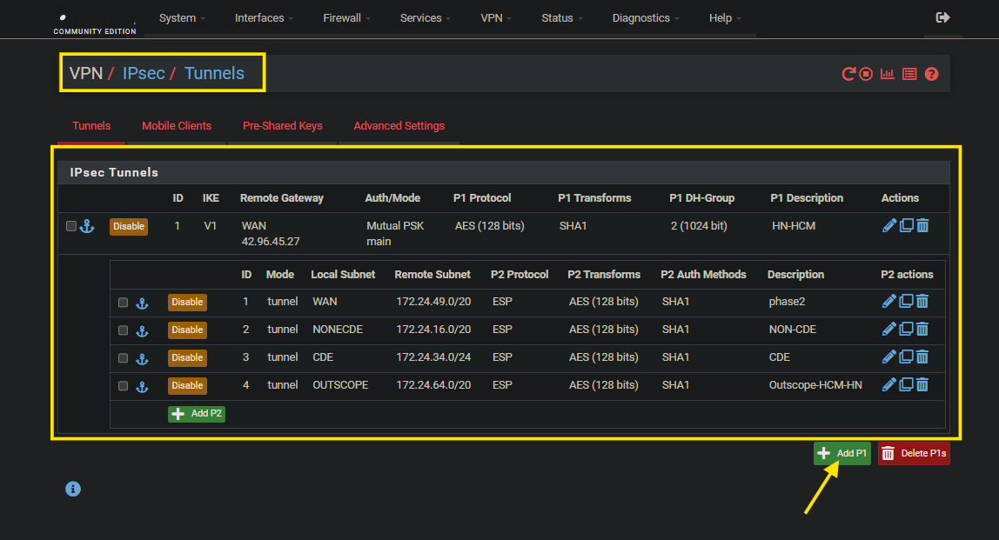
- In the Phase 1 configuration page of the IPsec VPN on the pfsense server, fill in the information according to the configuration similar to IPSec VPN in site HN.
  - `General Information` Setting
    - Enter a **Description**
    - Uncheck **Disabled** this box so that the tunnel will be operational.
  - `IKE Endpoint Configuration`
    - Key Exchange version: Specifies whether to use IKEv2 or IKEv1. IKEv2 is the best practice when supported by both endpoints. If one side does not support IKEv2, use **IKEv1** instead.
    - Internet Protocol: **IPv4** in most cases unless both WANs have IPv6
    - Interface: Most likely set to **WAN**
    - Remote Gateway: The WAN address at Site HN, in this example: `42.96.45.27`.
    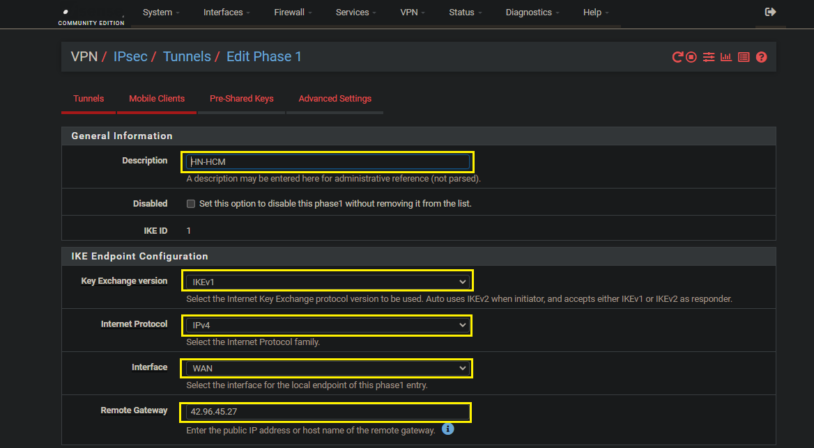
  - Setup `Phase 1 Proposal (Authentication)`
  
    The next section controls IPsec phase 1 proposals for encryption.
    - Authentication Method:The default, **Mutual PSK**
    - Negotiation mode: **Main**
    - My Identifier: **My IP Address**
    - Peer Identifier: **Any**
    - Pre-Shared key: generate a key (we will also need this value on our end)
  - `Phase 1 Proposal (Encryption Algorithm)`
  
    Encryption Algorithm:
    - Algorithm Select **AES**
    - Key length use **128bits**
    - Hash use **SHA256**
    - DH group **2** (1028bit)
  - `Expiration and Replacement`
    - The Expiration and Replacement section controls the timing and method by which phase 1 will be renegotiated.
      - Life Time: The default `28800` is OK for this endpoint.
      - The other lifetime-related values (Rekey Time, Reauth Time, Rand Time) should be left at their defaults on this endpoint as they are automatically calculated as the correct values.
  - `Advanced Options`
    - Child SA Close Action: Set this endpoint to **Default**. Moreover, have options **Restart/Reconnect** so that the phase 2 entries will be reconnected if they get disconnected.
    - Leave checked and at the default values.
  
  - Click **Save** when complete

***`Phase 2`***

With the phase 1 entry complete, now a new phase 2 definition to the VPN:

- Click **Show Phase 2 Entries** to expand the phase 2 list for this VPN.

- Click **Add P2** to add a new phase 2 entry.

Now add settings for phase 2 on this VPN. The settings for phase 2:

- `General Information`
  - Description: A brief description of the network(s) involved in this phase 2 entry.
  - Mode: Select ***Tunnel IPv4***
- `Networks`
  - Local Network: **WAN subnet** with interface WAN. **LAN Subnet** with interfaces: OutScope, CDE and NonCDE.
- `NAT/BINAT`
  - Set to **None**.
- `Remote Network`
  - Set to the network at Site HN, in this case: `172.24.49.0/24`


The next section of the phase 2 settings covers traffic encryption. Encryption algorithms and Hash algorithms can both be set to allow multiple options in phase 2, and both sides will negotiate and agree upon the settings so long as each side has at least one of each in common. In some cases that may be a good thing, but it is usually better to restrict this to the single specific options desired on both sides.

- `Phase 2 Proposal (SA/Key Exchange)`
  - Protocol: Set to **ESP** for encryption.
  - Encryption Algorithms: **AES (128bits)**
  - Hash algorithm use **SHA1**
  - PFS key group with **2(1024bit)**

- `Expiration and Replacement` and `Keep Alive`
  - Keep default


***NonCDE***


***CDE***


***OutScope***

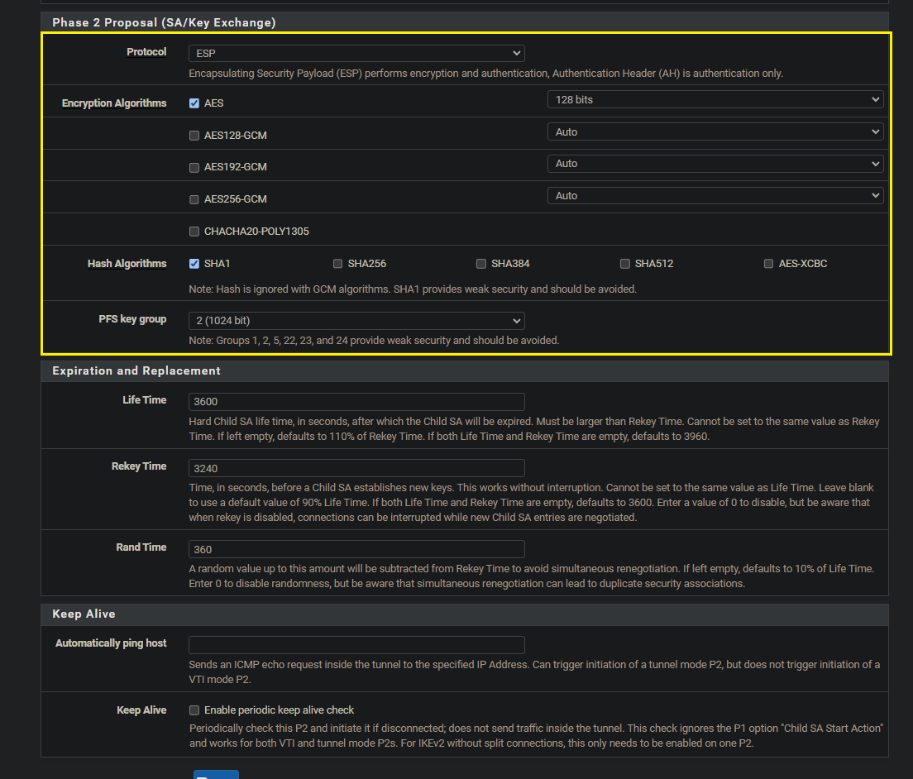

`Result:`


##### Configure Firewall for local connections Site HN

In the program menu, select `Firewall -> Rules -> WAN`. Click the **Add** button.

- Protocol: **TCP**, but you can also use Any.

- Source: **Any**.

- Destination: **Any**.


Configure rule OutScope VPN: `Firewall -> Rules -> OutScope`

- On the new page we check the parameters:

  - Customizable interface: **OutScope**.
Imgs/S2S-HN/hn23.png
  - Protocol: **TCP**, but you can also use Any.

  - Source: **Any**.

  - Destination: **Any**.
- Save the settings by clicking on the Save button.

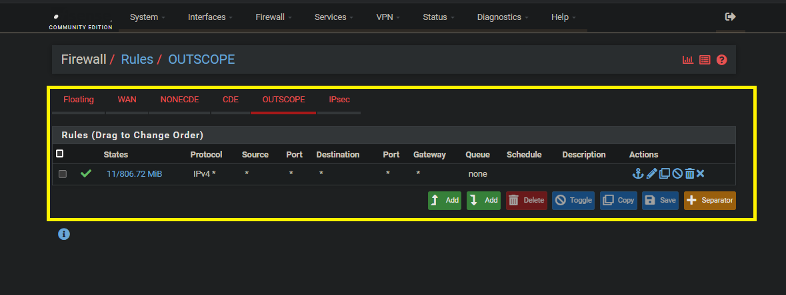

Do the same with CDE and Non CDE

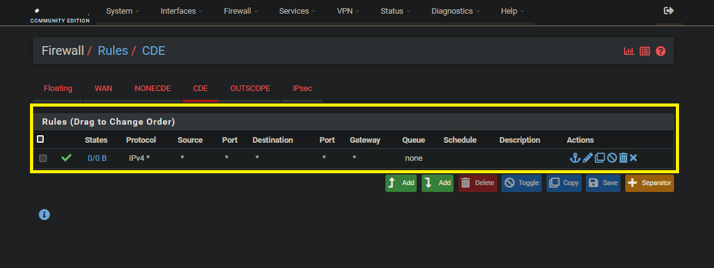


Configure rule IPSec VPN: `Firewall -> Rules -> IPSec`

- Protocol: **TCP**, but you can also use **Any**.

- Source: **Any**.

- Destination: **Any**.


It should be noted that the same settings must be made on all remote pfSense servers connected to a single network.

##### Config Route table in CMC-Cloud on Site HN

A route table contains a set of rules, called routes, that determine where network traffic from your subnet or gateway is directed.


### Build VPN Route Base (Using OSPF)

#### Routed IPsec (VTI)

Route-based IPsec is an alternative method of managing IPsec traffic. It uses `if_ipsec(4)` from FreeBSD for **Virtual Tunnel Interfaces (VTI)** and traffic is directed using the operating system routing table. It does not rely on strict kernel security association matching like policy-based (tunnel mode) IPsec.

Virtual Tunnel Interface (VTI) tunnels in pfSense are used to create a more streamlined way to handle IPsec VPN configurations. VTI tunnels simplify the process of creating site-to-site VPNs by treating the tunnel as a network interface, allowing for easier management and the ability to use dynamic routing protocols like **`OSPF`** or **`BGP`**.


> VPN Route-Based IPSEC

##### HANOI - Khanh's zone (Vùng 1) - PHAN

| FW - IP public   | Interface | IP address     | Subnet        |
|------------------|-----------|---------------|---------------|
| 42.98.43.148     | WAN       | 172.25.48.81  | 172.25.48.0/24|
|                  | LAN       | 172.25.68.10  | 172.25.84.0/24|
|                  | VTI       | 10.0.0.1      |               |
| PC               | LAN       | 172.25.64.193 | 172.25.84.0/24|

##### HCM - Khanh's zone (Vùng 2) - GIANG

| FW - IP public   | Interface | IP address     | Subnet        |
|------------------|-----------|---------------|---------------|
| 42.98.44.213     | WAN       | 172.21.2.154  | 172.21.0.0/20 |
|                  | VTI-toHN  | 10.0.0.2      |               |
|                  | VTI-toTRAM| 10.0.0.3      |               |

##### HCM - Tram's zone (Vùng 3) - TRI

| FW - IP public   | Interface | IP address     | Subnet        |
|------------------|-----------|---------------|---------------|
| 203.171.92.107   | WAN       | 192.168.2.200 | 192.168.0.0/24|
|                  | LAN       | 192.168.0.211 | 192.168.0.0/24|
|                  | VTI       | 10.0.0.4      |               |
| PC               | LAN       | 192.168.0.210 | 192.168.0.0/24|

Config in Phase1: **`AES128 - SHA1 - DH Group 2`**

- Key between zone 3 and zone 2:

  ```key
  4531f5a38fa3e74c8741c743aae8b7fd7ef4fec037f500d8ad1fa7e91
  ```

- Key between zone 1 and zone 2:

  ```key
   7751417e85b68855909314a7da81cbb2271efd65a801f4bc0118d8da
  ```

#### Step 1: Configure IPsec Tunnel on pfSense

1. Go to `VPN > IPsec` in the pfSense web GUI.

2. Click on the + Add P1 button to create a new Phase 1 entry.

3. Set the following parameters for the Phase 1 configuration:

   - Key Exchange version: IKEv1
   - Remote Gateway: IP address of the remote VPN endpoint
   - Authentication Method: Mutual PSK (Pre-Shared Key)
   - Pre-Shared Key: Enter a secure key
   - Encryption Algorithm: Choose a strong encryption method (e.g., AES)
   - Hash Algorithm: SHA-1 (or another secure hash)
   - DH Group: Choose an appropriate Diffie-Hellman group

> HANOI - Khanh's zone (Vùng 1)


> HCM - Khanh's zone (Vùng 2)

- toHCM-MrTram


- HCM-to-HN


> HCM - Tram's zone (Vùng 3)


#### Step 2: Configure Phase 2 (Child SA) for VTI

1. Click on + Add P2 under the Phase 1 you just created.

2. Set the following parameters for the Phase 2 configuration:

   - Mode: Tunnel IPv4
   - Local Network: Network Address, and enter an IP address in CIDR notation (e.g., 0.0.0.0/0 for all traffic)
   - Remote Network: Network Address, and enter 0.0.0.0/0
   - Protocol: ESP
   - Encryption Algorithms: Choose strong encryption settings (e.g., AES)
   - Hash Algorithms: Choose a secure hash (e.g., SHA-256)

3. In the Phase 2 proposal (SA/Key Exchange) section, set the following:

   - Lifetime: Set a reasonable value (e.g., 3600 seconds)
   - Enable Automatically ping host, if desired, to keep the tunnel alive.

4. Save the Phase 2 settings.

> HANOI - Khanh's zone (Vùng 1)


> HCM - Khanh's zone (Vùng 2)
>> HCM - Khanh's zone (Vùng 2) connect to HANOI - Khanh's zone (Vùng 1)


>> HCM - Khanh's zone (Vùng 2) connect to HCM - Tram's zone (Vùng 3)


> HCM - Tram's zone (Vùng 3)


#### Create the VTI Interface

1. Go to Interfaces > Assignments in the pfSense web GUI.
2. You should see a new interface named IPsec VTI available in the list.
3. Click Add to assign the IPsec VTI interface.
4. Click on the newly created interface and configure it:
   - Enable the interface
   - Set the IP Address (e.g., 10.0.0.1/30), where each end of the tunnel gets a unique IP in the subnet.
5. Save and apply the changes.

> HANOI - Khanh's zone (Vùng 1)


> HCM - Khanh's zone (Vùng 2)


> HCM - Tram's zone (Vùng 3)


#### Step 4: Firewall Rules for the VTI Interface

1. Go to Firewall > Rules and click on the newly created IPsec VTI interface.
2. Add rules to allow traffic to flow through the tunnel as needed.
   For example, add a rule to allow all traffic for testing purposes.
3. Save and apply the firewall rules.

Exp: Add rules to allow traffic for 3 zone.


#### Testing the VTI Tunnel

1. Ping the remote tunnel IP address to verify connectivity.
2. Ensure that traffic is being properly routed through the VTI tunnel.

> HANOI - Khanh's zone (Vùng 1)


> HCM - Khanh's zone (Vùng 2)


> HCM - Tram's zone (Vùng 3)


#### Step 5: Setup for OSPF on pfSense with VTI

##### I. Install the FRR Package on pfSense

1. Go to System > Package Manager > Available Packages.
2. Search for the FRR (Free Range Routing) package.
3. Click Install to add the package to your pfSense setup.
4. Once the installation is complete, go to Services > FRR Global/Zebra.

> [!NOTE]
> Install FRR on all 3 zones


##### II. Configure FRR Global Settings

1. Enable the FRR daemon by checking the box at the top of the page.
2. Make sure the Zebra routing manager is enabled.
3. Save and apply the settings.

> [!NOTE]
> Enable FRR on all 3 zones


##### III. Configure OSPF in FRR

1. Navigate to `Services > FRR OSPF`.
2. Check the box to **Enable OSPF**.
3. In the Router ID field keep default or enter a unique identifier for this pfSense router (typically the LAN IP address).
4. Under Networks, add the network associated with the VTI interface. For example:
   - Network: 10.10.10.0/30 (replace this with your actual VTI network)
   - Area: 0.0.0.0 (Area 0 is the backbone area for OSPF)
5. Click Save to apply these settings.

> OSPF config

OSPF setting


Areas setting


Interface setting

- HANOI - Khanh's zone (Vùng 1)
  


- HCM - Khanh's zone (Vùng 2)


- HCM - Tram's zone (Vùng 3)


##### IV. Configure Static Routing in Pfsense

1. Navigate to `System > Routing > Static Routes`.
2. Select + **Add** button to create a new static route.
3. Configure the Static Route:
   - Destination network: Enter the destination network (e.g., 192.168.2.0/24).
   - Gateway: Select the gateway that pfSense should use to reach the destination network. Ở đây chúng ta sử dụng gateway vti.
   - Optionally, you can add a Description for the route.
4. Click **Save** to **apply** activate the new route..

> HANOI - Khanh's zone (Vùng 1)


> HCM - Khanh's zone (Vùng 2)


> HCM - Tram's zone (Vùng 3)


##### V. Check status OSPF in FRR

1. Navigate to `Status > FRR`.
2. Select  **OSPF** button to query status service ospf.

> HANOI - Khanh's zone (Vùng 1)


> HCM - Khanh's zone (Vùng 2)


> HCM - Tram's zone (Vùng 3)


##### V. Check ping

> Access the PC on zone 1, add route and perform ping test.


- Show route before add new route


- Add route and ping to Lan


- Ping to PC


> Access the PC on zone 3, add route and perform ping test.


- Show route before add new route


- Add route and ping to Lan


- Ping to PC


### Build VPN With GRE-TUNNEL

Generic Routing Encapsulation (GRE) is a method of tunneling traffic between two endpoints without encryption. It can be used to route packets between two locations that are not directly connected, which do not require encryption. It can also be combined with a method of encryption that does not perform its own tunneling.

> [!NOTE]
> The GRE protocol was originally designed by Cisco, and it is the default tunneling mode on many of their devices.

GRE tunnels can carry either IPv4, IPv6, or both types of traffic at the same time.

End. -->
